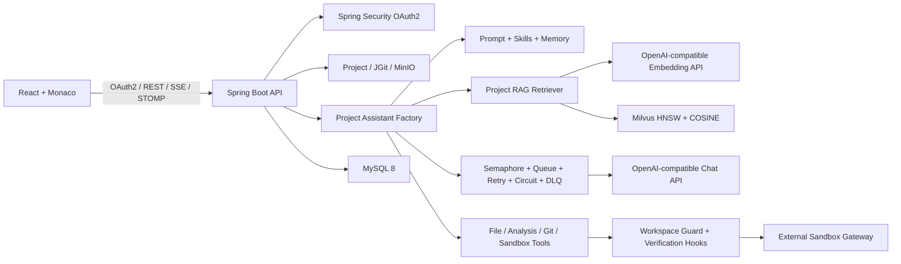

# AI Coding Platform

基于 Spring Boot 与 LangChain4j 的云端 AI Coding 平台。用户通过 GitHub OAuth2 登录后，可导入仓库到隔离工作区，在浏览器中完成代码浏览、编辑、同步、AI 问答、代码审查与解释。项目重点不是单次模型调用，而是把代码资产管理、项目级 RAG、Agent 工具链、上下文治理和可观测 Harness 组合成一条可运行的工程链路。

## 核心能力

- **云端代码资产**：GitHub OAuth2 登录、仓库导入、JGit 同步、MinIO 备份、Monaco Editor 与 WebSocket 协同更新。
- **项目级 Agent**：用 `ConcurrentHashMap<Long, AiCodingAssistant>` 缓存每个项目的定制 Assistant，组装文件、代码分析、Git、记忆和沙箱工具。
- **RAG 索引**：代码文件批量加载、递归切片、Embedding 摄入；每个项目独立 collection，摄入与检索共享同一 `EmbeddingStore`。
- **Prompt / Context Engineering**：Markdown 模块化 System Prompt、Skills 渐进式披露、RAG 按需召回、三层上下文压缩与 JPA 长期记忆。
- **Harness Engineering**：工作区边界、写入前 Hook、沙箱验证、运行审计和定时 HEARTBEAT，降低 Agent 越权与“改完不验证”的风险。
- **LLM 稳定性治理**：公平信号量、带 TTL 的优先队列、指数退避重试、熔断器和有界 DLQ。

## 系统架构



## 运行界面（早期 Demo）

以下截图来自项目早期可运行版本，用于展示 GitHub 登录与项目导入、Monaco 云端编辑器和 AI Chat 的完整交互链路。本次版本升级主要集中在后端 Agent、RAG、上下文治理、Harness 和并发稳定性，前端核心工作流未发生结构性变化；截图不代表新增后台能力已经全部可视化。

### GitHub 登录与项目导入


### 项目文件与 Monaco 编辑器


### 代码编辑与 AI Chat


## 关键业务链路

### 1. 登录、导入与工作区

GitHub OAuth2 登录成功后，平台持久化用户信息和访问令牌；导入接口使用当前登录用户的 Token 通过 JGit 克隆仓库，并将项目落到 `${workspace.base-path}/{userId}/{projectId}`。后续文件读取、AI 调用、WebSocket 更新、Git 同步和备份都会先校验 `projectId + userId`，避免跨用户访问。API 对外返回 `ProjectDTO`，不会直接序列化包含令牌的 User 实体。

### 2. 索引与向量检索

`AIService#indexProject` 扫描项目内 Java、Kotlin、JS/TS、Python、Go 和 Markdown 文件，拒绝符号链接及工作区外路径，并忽略 `.git`、`node_modules`、`target`、`build`。文档经 `DocumentSplitters.recursive(500, 50)` 切片后批量生成向量，写入项目独立的 EmbeddingStore；重建索引后会驱逐旧 Assistant，确保 Retriever 绑定新 Store。

默认使用内存向量库便于本地演示；启用 `milvus` Profile 后，每个项目创建 `project_{projectId}` collection，底层索引为 **HNSW**，距离度量为 **COSINE**，一致性级别为 `BOUNDED`。当前默认 Embedding 模型是 `text-embedding-3-small`，维度为 1536；切换模型时必须同步调整 `ai.milvus.dimension` 并重建 collection。

### 3. Agent 与 Prompt 组装

首次访问项目时，`AiServiceFactory` 原子创建并缓存 Assistant。System Prompt 由 `identity.md`、`tool-policy.md`、`safety.md`、`harness.md`、项目身份、Skills 元数据及项目内 `.aicoding/AGENT.md` 动态拼装。运行时再根据用户意图加载匹配的内置或项目级 Skill，并注入相关长期记忆，避免把所有上下文一次性塞入窗口。

### 4. 上下文与记忆

短期记忆按 `projectId + sessionId` 隔离，并采用三层压缩：L1 截断超长工具结果，保留头尾证据；L2 超过消息阈值后把旧轮次压缩为确定性摘要；L3 提供显式 compact 接口。长期记忆以 `AgentMemory` 存入 MySQL，按项目、类型、更新时间和查询关键词召回，用于保存项目事实、用户偏好、错误经验和关键决策。

### 5. 工具调用与 Harness

Agent 的文件写入先经过 `WorkspaceGuard`：拒绝绝对路径、`..` 穿越、符号链接逃逸、控制文件修改、超限写入及未授权删除。代码变更完成后，Verification Hook 根据文件类型生成 Maven、npm 或 Python 检查命令，并交给外部 Sandbox Gateway 执行；Spring Boot 主进程不直接运行生成代码。Harness Runtime 记录任务策略、违规和验证结果，定时 HEARTBEAT 汇总稳定性、服从性、活动任务、队列、熔断与 DLQ 状态。

### 6. 并发与故障恢复

流式模型外层由 `ConcurrentChatModel` 装饰。请求先进入带过期时间的优先队列，再通过公平 `Semaphore` 限制并发；超时、429、连接异常和部分 5xx 在未输出 Token 时进入指数退避重试。连续可重试失败达到阈值后开启熔断，最终失败写入有界 DLQ，并通过 HEARTBEAT 暴露。该设计优先保证服务可用性和队列可控，不将内存队列包装成强一致分布式消息系统。

## 技术栈

| 分层 | 技术 |
| --- | --- |
| 后端 | Java 21、Spring Boot 3.4、Spring MVC、WebSocket/STOMP |
| AI | LangChain4j 1.1、OpenAI-compatible Chat/Embedding API、Project RAG |
| 数据 | Spring Data JPA、Hibernate、MySQL 8、Milvus、MinIO |
| 安全与代码 | Spring Security OAuth2 Client、JGit、Workspace Guard、Sandbox Gateway |
| 前端 | React 18、TypeScript、Vite、Monaco Editor |
| 测试 | JUnit 5、Spring Boot Test、H2 MySQL mode |

## 目录说明

```text
frontend/                              React + Monaco 编辑器
src/main/java/com/aicoding/
  Controller/                          REST、SSE、STOMP 入口
  Service/                             项目、OAuth2、存储业务
  ai/
    ConcurrentClass/                   LLM 并发、队列、重试、熔断、DLQ
    harness/                           Workspace、验证 Hook、HEARTBEAT
    memory/                            分层上下文与长期记忆
    prompt/                            Prompt 模块与 Skills 加载
    rag/                               项目级 EmbeddingStore 注册表
    tools/                             Agent 工具集合
src/main/resources/agent/              Markdown Prompt 与 Skills
src/milvus/java/                       可选 Milvus 实现
```

## 本地启动

### 环境要求

- JDK 21、Maven 3.9+
- Node.js 18+
- Docker Compose
- GitHub OAuth App
- OpenAI-compatible Chat / Embedding API

### 1. 启动基础设施

本机已经运行 MySQL 时，只启动 Agent 依赖的 MinIO、etcd 和 Milvus，避免容器占用本机 `3306`：

```bash
docker compose -f src/main/resources/docker-compose.yml up -d minio etcd milvus
```

没有本机 MySQL 时，可启用 Compose 的 `database` Profile，一次启动 MySQL 8 和其余基础设施：

```bash
docker compose -f src/main/resources/docker-compose.yml --profile database up -d
```

### 2. 准备本地配置

仓库中的 `application.yaml` 已使用环境变量，不包含真实密码。至少配置：

```bash
DB_URL=jdbc:mysql://127.0.0.1:3306/aicode?useUnicode=true&characterEncoding=utf8&serverTimezone=Asia/Shanghai&useSSL=false&allowPublicKeyRetrieval=true
DB_USERNAME=root
DB_PASSWORD=your_password
GITHUB_CLIENT_ID=your_client_id
GITHUB_CLIENT_SECRET=your_client_secret
OPENAI_API_KEY=your_api_key
```

若本机 MySQL 还没有数据库，可先执行 `CREATE DATABASE aicode CHARACTER SET utf8mb4 COLLATE utf8mb4_unicode_ci;`，也可以保留默认 URL 中的 `createDatabaseIfNotExist=true`，前提是数据库账号具有建库权限。

GitHub OAuth App 的本地回调地址应为：

```text
http://localhost:8080/login/oauth2/code/github
```

### 3. 启动后端

```bash
# 内存向量库
mvn spring-boot:run -Dspring-boot.run.profiles=local

# Milvus：HNSW + COSINE
mvn -Pmilvus spring-boot:run -Dspring-boot.run.profiles=local -Dspring-boot.run.arguments=--ai.rag.store=milvus
```

也可直接设置环境变量 `AI_RAG_STORE=milvus`。后端默认监听 `http://localhost:8080`。

### 4. 启动前端

```bash
cd frontend
npm install
npm run dev
```

前端默认监听 `http://localhost:3000`，Vite 会代理 `/api`、`/oauth2`、`/login` 和 `/ws` 到后端。

## Sandbox Gateway 契约

启用 `SANDBOX_ENABLED=true` 后，平台调用两个外部接口：

- `POST /api/sandbox/execute`：接收 `projectId`、`language`、`code`，用于显式代码片段执行。
- `POST /api/sandbox/verify`：接收 `projectId`、`workspace`、`changedFile`、`commands`、`networkDisabled=true`，用于编译和测试。

Gateway 应自行实现容器隔离、只挂载目标工作区、CPU/内存/进程/时间限制、默认禁网及输出截断。当前仓库只实现网关客户端和验证编排，不包含生产级容器运行时。

## 主要接口

| 接口 | 说明 |
| --- | --- |
| `GET /api/auth/user` | 当前 GitHub 登录用户 |
| `POST /api/projects/import/github` | 导入 GitHub 仓库 |
| `GET /api/projects/{id}/files` | 获取项目文件树 |
| `POST /api/ai/projects/{id}/index` | 重建项目 RAG 索引 |
| `POST /api/ai/chat/stream` | 项目上下文流式对话 |
| `POST /api/ai/code/review` | 项目上下文代码审查 |
| `POST /api/ai/context/compact` | 显式压缩会话上下文 |
| `GET /api/ai/harness/heartbeat` | Harness 与 LLM 稳定性快照 |
| `STOMP /app/code.update` | 云端文件更新与广播 |

除认证检查外，业务接口均要求登录，并对项目归属进行校验。

## 验证命令

```bash
mvn test
mvn -Pmilvus -DskipTests compile
cd frontend && npm run build
docker compose -f src/main/resources/docker-compose.yml config
```

## 当前边界

- 默认内存向量库不持久化，生产或多实例部署应启用 Milvus。
- LLM 请求队列与 DLQ 当前位于单 JVM 内，实例重启会丢失；需要跨实例恢复时可替换为 Kafka/RabbitMQ 等持久化消息系统。
- 长期记忆使用轻量关键词评分，不等同于语义记忆检索。
- Sandbox Gateway 是外部依赖，禁用时验证结果会明确标记为 `SKIPPED`，不会伪装成通过。
- GitHub Token 已禁止通过 JSON 响应暴露；生产环境仍应增加字段级加密、密钥轮换和最小权限 Scope。
